# Motor Controller with PID, Modbus RTU and Modbus TCP
## Overview
This project implements an industrial-style DC motor controller based on STM32F411 with closed-loop control using a PID controller.

 The controller can be operated remotely through both:

- **Modbus RTU (RS485)**
- **Modbus TCP (Ethernet)**

The firmware is built on FreeRTOS and uses a modular architecture with dedicated drivers for motor control and communication interfaces.

The controller supports two operating modes:

- **Speed Mode** – maintain a constant RPM using PID control
- **Position Mode** – move the motor to a target angular position

The system was designed to demonstrate a complete embedded control application including:

- real-time control
- fieldbus communication
- RTOS task management
- performance monitoring
- safety mechanisms
---
## Components
The following hardware components were used:

-	MCU: STM32F411CEU6
-	Ethernet Controller: W5500
-	RS485 Transceiver: UART to RS485 module
-	Motor Driver: BTS7960
-	Motor: 12V DC Gear Motor (100 RPM) with Quadrature Encoder
-	Debugger: ST-Link
- USB-UART Adapter: FTDI
-	USB-RS485 Adapter
---
## Peripheral Configuration
### Encoder Interface
Motor position and speed are measured using a quadrature encoder.

-	Timer: **TIM2 (32-bit)**
-	Channels: **CH1 + CH2**
-	Encoder resolution: **400 pulses per channel**

Using quadrature decoding:

Encoder resolution = **1600 counts per revolution (CPR)**

---
### PWM Generation
Motor speed control is implemented using PWM.

- Timer: **TIM4**
- Channels:
  - CH1 → Motor direction A
  - CH2 → Motor direction B
- PWM frequency: **1.25 kHz**
- Driver enable pin: **PB0**
---
The motor control loop runs at a fixed sampling rate using a dedicated timer.

- Timer: **TIM9**
- Frequency: **500 Hz**
- Function:
  - encoder sampling
  - motor control update
  - task notification to the Motor Control Task

This design keeps the control loop timing independent from other application tasks.

---
### FreeRTOS Runtime Statistics
CPU usage and task statistics are measured using:

-	Timer: **TIM10**

This timer provides the clock source for:

-	FreeRTOS **RunTimeStats**
-	CPU load measurement
-	task execution profiling
---
## Communication Interfaces
### Modbus RTU
-	Interface: **USART2**
-	Physical layer: **RS485**
-	**DMA** is used for RX/TX to minimize CPU usage.
  
Supported functions:

-	**F03** – Read Holding Registers
-	**F06** – Write Single Register
-	**F10** – Write Multiple Registers
---
### Modbus TCP
-	Ethernet controller: **W5500**
-	Interface: **SPI1**
-	Socket-based TCP server implementation.

Supported functions:

-	**F03** – Read Holding Registers
-	**F06** – Write Single Register
-	**F10** – Write Multiple Registers
---
### Debug Monitor
A temporary **monitor task** is implemented for debugging and system monitoring.

- Interface: **USART1**
- Used to display:
  - CPU load
  - RTOS task state
  - stack usage
  - system diagnostics

DMA is not used here since it is only intended for development.

---
## Motor Control
### Speed Mode
In Speed Mode the user sets a **target RPM** through Modbus registers.

The controller uses:
-	**Soft start acceleration**
-	**PID closed-loop control**
-	**Dynamic PWM adjustment based on load**

The PID controller continuously adjusts PWM duty cycle to maintain a constant motor speed.

### PID Parameters

| Parameter | Value |
|----------|-------|
| Kp       | 1.8   |
| Ki       | 1.4   |
| Kd       | 0.0   |

---
### Position Mode
In Position Mode the motor moves to a **target angular position**.

The controller implements a simple motion profile:

-	acceleration when far from target
-	automatic deceleration near the target
-	stop inside a defined tolerance window
  
Control behavior:

-	maximum speed depends on distance to target
-	RPM is gradually reduced as the motor approaches the target
-	motor stops when the position error enters the tolerance band

**Key parameters:**
MAX_POSITION_SPEED_RPM = 3600

KP_POSITION = 0.035

POSITION_TOLERANCE_COUNTS = 10

---
### Register Map
The controller can be operated through the following Modbus registers:

| Register | Name | Description |
|----------|-------|-------------|
| 0        | TARGET_RPM  | Desired motor speed|
| 1        | TARGET_POSITION  | Target position (degree) |
| 2        | MODE  | Control mode (Speed / Position) |
| 3        | ACTUAL_RPM  | Measured motor speed |
| 4        | ACTUAL_POSITION   | Current motor position |
| 5        | PWM_OUTPUT   | Current PWM duty cycle |

---
### Control Parameters
MAX_DUTY = 799

ENCODER_CPR = 1600

ACCEL_RPM_PER_SEC = 4000

DECEL_RPM_PER_SEC = 8000

CONTROL_HZ = 500

---
### Real-Time Architecture
The firmware is built on **FreeRTOS** with separate tasks for different system components.

Example tasks include:

-	Motor Control Task
-	Modbus RTU Task
-	Modbus TCP Task
-	Monitor Task

CPU statistics show:

-	**Idle Task: ~93%**
-	**Application Load: ~7%**

This indicates the system has significant processing headroom.

---
### Safety Features
The system includes several safety mechanisms:

**Independent Watchdog (IWDG)**

The watchdog automatically resets the system if the firmware becomes unresponsive.

**Stack Overflow Detection**

FreeRTOS stack overflow protection is enabled.

If an overflow occurs, the system reports the faulty task through UART.

---
## Testing
### Speed Control – Step Response
The controller was tested using step changes in target RPM.

Results show:

-	low overshoot
-	stable settling behavior
-	accurate speed tracking

  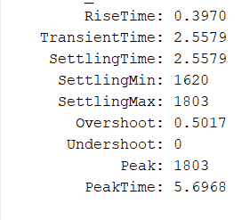

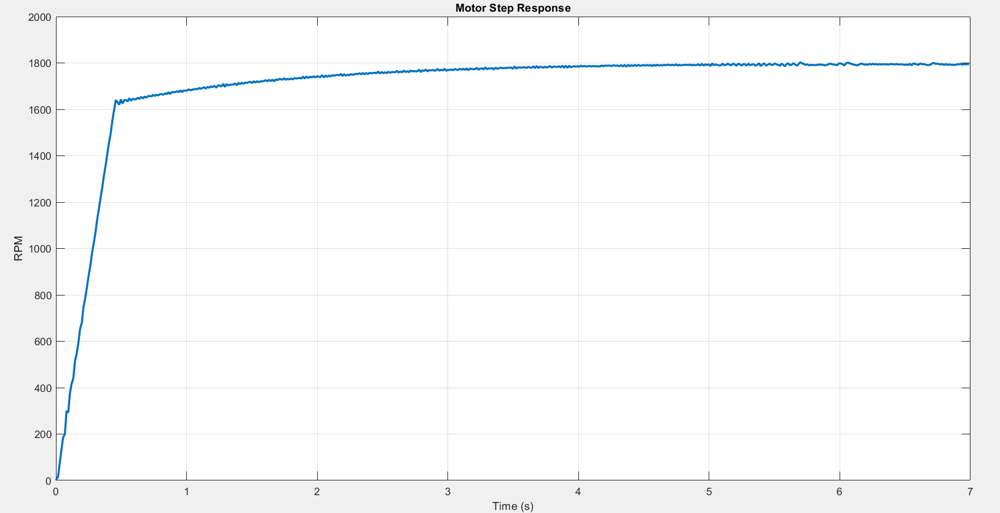
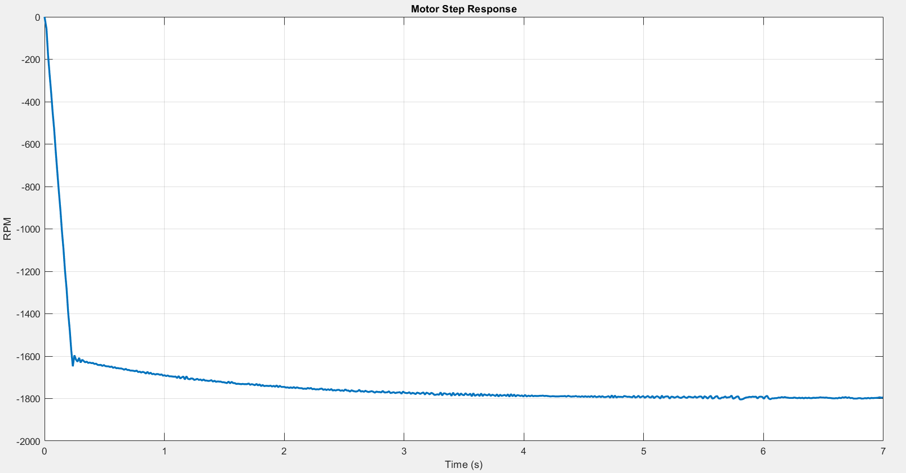

---
### Position Control
Position mode was tested with various target angles.

The motor successfully reaches the target and stops smoothly within the tolerance band.

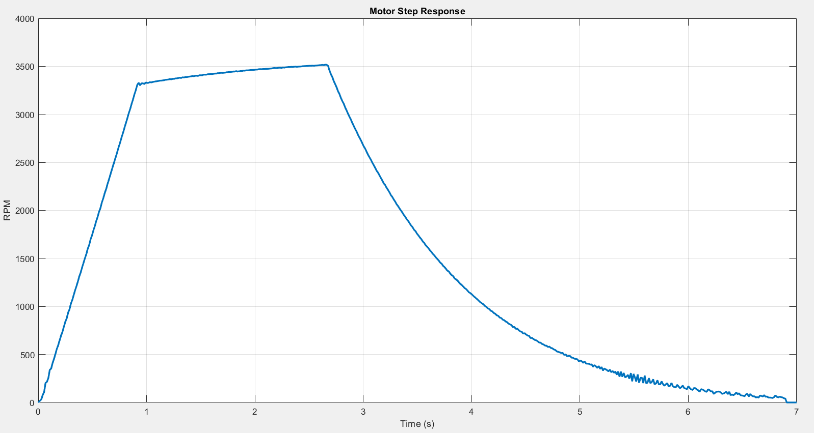
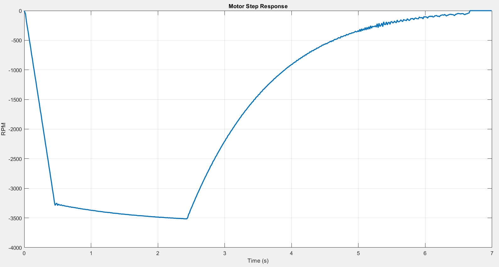

---
### Load Disturbance Test
Additional tests were performed by applying mechanical load to the motor shaft.

Results show:

-	RPM remains stable
-	PWM output adjusts dynamically to compensate for load changes

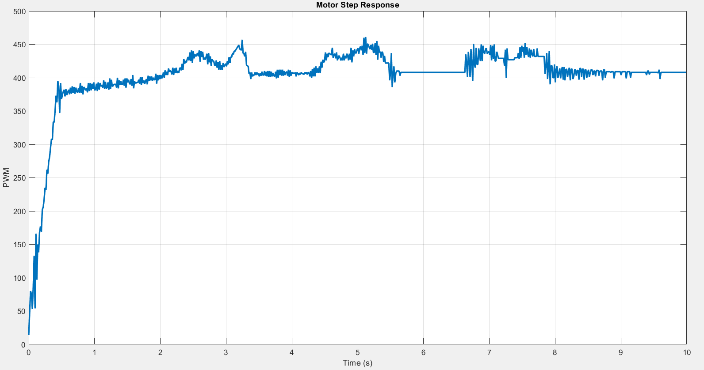
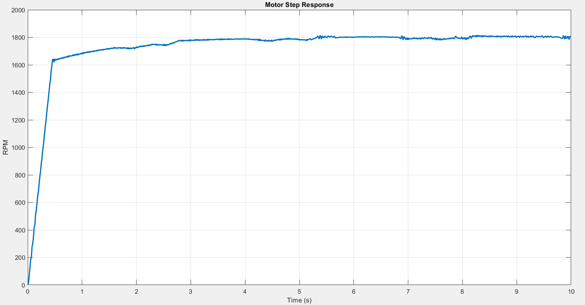

---
### Modbus RTU Communication
Modbus RTU frames were verified using a logic analyzer.

The captured frames confirm correct implementation of:

-	**F03**

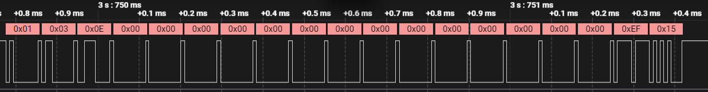

  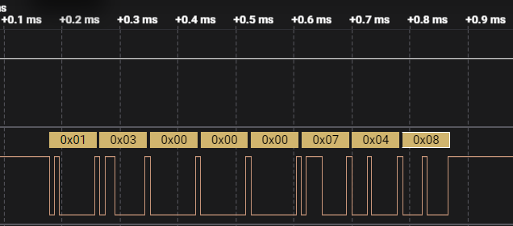

 
-	**F06**

  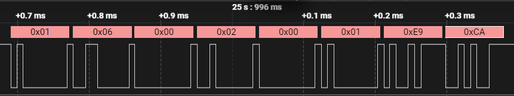

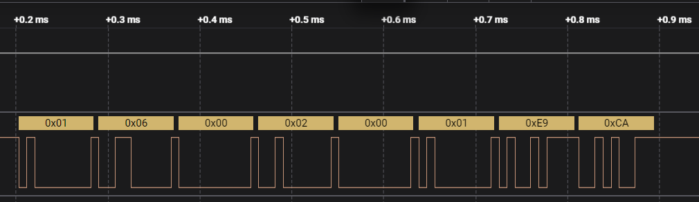
  
-	**F10**

  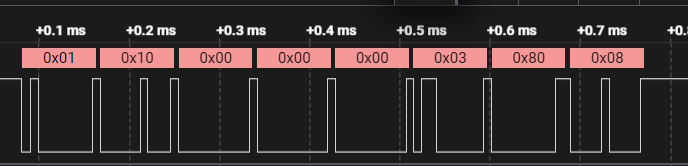

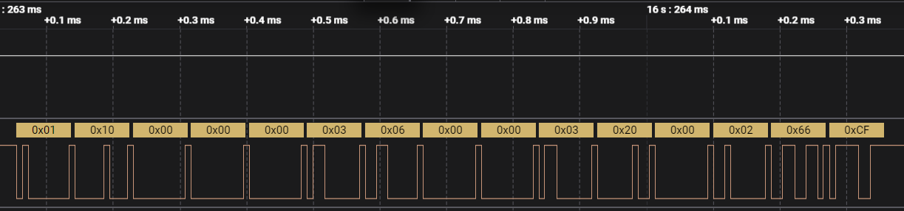

---
### System Performance
Measured results:

-	CPU Load: ~7%
-	Idle Time: ~93%
-	All task stacks within safe limits.

This confirms efficient use of MCU resources.

  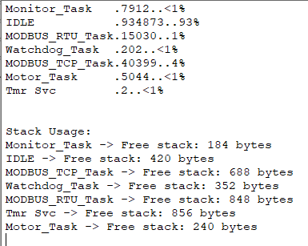

---
## Future Improvements
Possible future extensions include:

-	acceleration profile (trapezoidal motion)
-	additional Modbus function codes
-	closed-loop current control
-	web configuration interface
-	industrial PCB design

---
## License
This project is open source and available for educational and research purposes.

---
